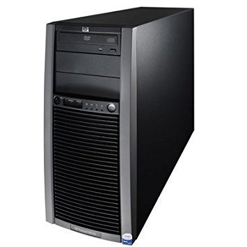

# The Computers

    This homelab was put together on a budget for experimenting with the tools I am learning for working with DevOps. I have proved that it can be VERY inexpensive to buy a server setup that is very useful.

## HP Proliant ML150 G5

    This is a Tower Server from 2009 that I paid $40 dollars for. Very inexpensive, it was my first interaction with setting up servers. I installed Ubuntu Server, installed the LAMP stack, and have it hosting a couple of websites. I also have it running a Discord Bot I coded with Python. 

    It came with 4GB of RAM, and one Xeon E5410 processor. 

    Now that I am learning Docker and Kubernetes, and I also want to install many more services and functionalities on the server, I have purchased two more RAM sticks for $30 (DDR2 ECC 677MHz, 4GB each); and another Xeon E5410 processor for $10 (The server can have 2 parallel processors). 

    The total cost for this machine ended up being $80, almost everything bought second-hand in very good condition. 

## Gateway (Old Used PC)

    The person who sold me the Proliant offered me another computer for $30 dollars as well, and I went ahead and took the deal. 

    Intel Quad CPU Q8300 @ 2.50 GHz, with 8GB of ram. Not too bad for what I paid on it. 

    It is not in use yet, but I have some neat plans for it. 

# The Plans

    The plan is to install the web server on the Gateway PC, which is slower, and shut it off from my other subnets. 

    That will then free my Proliant Tower for more interesting uses, experiments, and services for my home, because right now, that is the one closed off from my system.

    I will make a more detailed post some other day about my security measures for hosting a webserver from home.